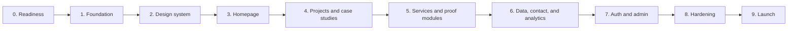

# Portfolio Website Production Roadmap Design

**Status:** Approved roadmap structure; implementation has not started.

**Purpose:** Define the production build sequence for Yehia Alsaeed's portfolio website. This is the master roadmap for the entire v1 release. Each phase will receive its own execution-level implementation plan immediately before work on that phase starts.

**Sources of truth:**

1. `prd.md` defines product scope and locked technology choices.
2. `handoff.md` records decision history, rejected ideas, and content context.
3. `mockups/demo/` is the approved visual and interaction reference.
4. This document defines implementation order, dependencies, and quality gates.

## 1. Delivery Model

The project will use vertical phases rather than a frontend-only pass followed by a backend-only pass. Every phase must leave the repository buildable, deployable, and testable. Preview deployment begins in Phase 1 so production-environment problems are discovered early.

The master roadmap deliberately does not contain file-by-file code steps. Before each phase begins, create a dedicated implementation plan in `docs/superpowers/plans/` containing exact files, interfaces, tests, commands, expected results, and commits.



## 2. Locked Architecture

### Application

- Next.js App Router with strict TypeScript.
- Public pages are Server Components and statically rendered or ISR by default.
- Client Components are limited to interactions that require browser state: display modes, command palette, filters, proof modules, iframe controls, forms, and admin charts.
- Next.js route handlers and Server Actions provide the backend. There is no separate API server.
- Vercel Hobby hosts preview and production deployments.

### Content

- Hand-written site copy, case studies, project overrides, metrics, and Cloudinary public IDs live in typed content modules in the repository.
- GitHub API data is fetched server-side and cached with daily revalidation. A checked-in fallback dataset keeps `/projects` available when GitHub is unavailable or rate-limited.
- Technical case studies and commercial client work remain separate content types because their evidence requirements differ.
- No CMS is introduced in v1.

### Data and services

- Neon Postgres stores application-owned analytics events, daily aggregates, contact messages, and rate-limit buckets.
- Drizzle owns application schema definitions, migrations, and typed queries.
- Neon Auth owns authentication tables and the single admin session flow. Public registration is disabled.
- Cloudinary serves project media. The database stores no image binaries.
- Recharts is loaded only in authenticated admin dashboard routes.
- React Flow is loaded only on case-study routes that use Architecture X-Ray.
- Resend notifications remain optional. Contact persistence and the admin inbox must work without Resend.

### Suggested production structure

```text
src/
  app/
    (public)/
      page.tsx
      projects/
      services/
    admin/
    api/
    opengraph-image.tsx
    sitemap.ts
    robots.ts
  components/
    layout/
    ui/
  features/
    admin/
    analytics/
    case-studies/
    contact/
    display-mode/
    live-preview/
    projects/
  content/
    case-studies/
    client-work.ts
    profile.ts
    project-overrides.ts
  db/
    schema/
    migrations/
    client.ts
    queries/
  lib/
    cloudinary.ts
    github.ts
    rate-limit.ts
    env.ts
  styles/
    globals.css
tests/
  unit/
  integration/
  e2e/
public/
  cv/
  textures/
```

Files should be grouped by product responsibility. Avoid global utility folders containing unrelated code and avoid components that own data fetching, layout, interaction, and persistence at the same time.

## 3. Non-Negotiable Engineering Rules

### Responsive UI

Every public and admin interface must be designed and verified for desktop, tablet, and mobile as part of the task that creates it.

Required verification widths:

| Class | Required widths | Purpose |
|---|---:|---|
| Small mobile | 360px and 390px | Long words, compact controls, smallest supported layout |
| Tablet portrait | 768px | Navigation, grid collapse, touch interactions |
| Tablet landscape / small laptop | 1024px | Intermediate layout, admin density |
| Desktop | 1440px | Primary approved composition |
| Wide desktop | 1920px | Maximum-width behavior and unwanted stretching |

Passing responsive behavior means:

- No horizontal page overflow, overlapping content, clipped labels, or unreadably small text.
- Fixed-format elements use stable dimensions, aspect ratios, and responsive constraints.
- Controls remain at least 44px in their primary touch dimension where practical.
- Hover interactions have keyboard and touch equivalents.
- Mobile is a deliberate layout, not a scaled-down desktop composition.
- The 1440px design remains visually faithful to the approved demo.

### Code quality and anti-slop standard

"No AI slop" is enforced through concrete review rules:

- No fabricated metrics, testimonials, client claims, project outcomes, or placeholder prose.
- No generic gradients, decorative blobs, nested cards, excessive rounded containers, or UI patterns that contradict the approved Swiss-grid system.
- No unnecessary dependency, abstraction, wrapper, hook, context, or configuration layer.
- No large multipurpose component when behavior can be separated by a clear domain boundary.
- No duplicated constants, project metadata, color values, route definitions, or event names.
- No vague names such as `data`, `item`, `handler`, or `utils` when a domain-specific name is available.
- No dead code, commented-out implementations, empty narration comments, unresolved warnings, or disabled tests.
- Generated code must be read, understood, adapted to repository conventions, and tested before acceptance.
- User-facing copy must be specific to Yehia, his evidence, and the visitor's task.

### Performance

Performance is an acceptance criterion for every phase.

- Public routes use static rendering or ISR unless request-time data is required.
- Server Components are the default; adding `"use client"` requires an interaction or browser API.
- Fonts are self-hosted or loaded through `next/font` with controlled subsets and weights.
- Images use responsive sizes, explicit dimensions, modern formats, and Cloudinary transformations where applicable.
- Iframes are click-to-load. React Flow, Recharts, and other expensive modules are dynamically imported at route or component boundaries.
- No blocking analytics, third-party scripts, autoplay media, or background network polling.
- The analytics beacon uses `keepalive` and never blocks navigation.
- V1 uses the custom first-party analytics system only; Vercel Analytics is not added in parallel.
- Bundle changes are reviewed per phase; an unexplained route JavaScript increase greater than 10% blocks completion.

Required release targets, measured on production-like Vercel previews:

| Metric | Target |
|---|---:|
| Largest Contentful Paint | <= 2.5s at the 75th percentile |
| Interaction to Next Paint | <= 200ms at the 75th percentile |
| Cumulative Layout Shift | <= 0.1 at the 75th percentile |
| Lighthouse Performance | >= 95 on representative public routes |
| Lighthouse Accessibility | >= 95, with no critical axe violations |
| Lighthouse Best Practices | >= 90 |
| Lighthouse SEO | 100 |

### Practical scalability

The website must scale cleanly beyond its initial portfolio traffic without introducing infrastructure that the free deployment does not need.

- Database access occurs through focused query modules, never directly from UI components.
- Analytics queries use indexed event type, path, visitor hash, and timestamp columns.
- Admin lists use cursor or keyset pagination; they never load an unbounded table.
- Raw analytics use a rolling retention window. Daily aggregates preserve long-term trends within Neon's storage limit.
- Rate limiting uses atomic Neon-backed fixed-window buckets keyed by a salted hash; it does not rely on server-process memory.
- GitHub, Cloudinary, and optional email failures degrade to cached content, local fallbacks, or persisted inbox data.
- Expensive proof interactions operate on static/precomputed data and never spend paid model tokens during page visits.
- New project and case-study content is added through typed data, not by duplicating route components.
- Architecture remains a single Next.js application. Microservices, queues, and extra paid providers require measured evidence before adoption.

### Accessibility and security

- Semantic landmarks and one meaningful `h1` per route.
- Full keyboard access, visible focus, WCAG AA contrast, reduced-motion support, and useful image alt text.
- Forms use native labels, clear error summaries, and server-side field/type/length checks without adding a validation library.
- Contact and analytics endpoints use honeypot checks, payload limits, rate limits, and safe error responses.
- Raw IP addresses are never stored. Visitor IDs use a daily rotating salted hash.
- Admin routes and APIs are protected server-side. Client redirects are never treated as authorization.
- Secrets exist only in local ignored environment files and Vercel environment settings.

## 4. Testing and Review Gates

Every phase implementation plan must include:

1. Unit tests for pure content mapping, parsing, formatting, and data utilities.
2. Integration tests for route handlers, Server Actions, database queries, and failure behavior.
3. Playwright tests for important visitor and admin journeys.
4. Automated accessibility checks with `@axe-core/playwright` on representative routes.
5. Desktop, tablet, and mobile screenshots inspected manually against the approved demo.
6. `pnpm lint`, `pnpm typecheck`, `pnpm test`, and `pnpm build` passing with no ignored errors.
7. A Vercel preview smoke test before the phase is merged.

A phase is not complete when the happy path merely renders. Error, empty, loading, slow-network, reduced-motion, keyboard, and narrow-screen states must be accepted where relevant.

## 5. Production Phases

### Phase 0: Readiness and source-of-truth audit

**Goal:** Remove avoidable uncertainty before scaffolding production code.

**Deliverables:**

- Confirm `prd.md`, `handoff.md`, this roadmap, and the updated static demo agree.
- Create the GitHub repository and choose the default branch and commit conventions.
- Record environment-variable names without storing values.
- Inventory approved local assets and the Cloudinary upload set.
- Export the selected CV to a web-ready PDF or explicitly use a temporary disabled download state until the final PDF is supplied.
- Record each client project's public-display status: named, anonymized, screenshot-only, live embed, or hidden placeholder.
- Recheck current free-tier limits immediately before provisioning Neon, Cloudinary, Vercel, Neon Auth, and optional Resend.

**Exit gate:** No contradictory scope remains; unresolved CV or client approvals have an explicit non-blocking UI state; no secret or client-confidential asset enters the repository.

### Phase 1: Foundation, tooling, and preview deployment

**Goal:** Establish a production-grade Next.js repository that continuously proves it can lint, test, build, and deploy.

**Deliverables:**

- Scaffold Next.js App Router, strict TypeScript, Tailwind CSS, and shadcn/ui.
- Configure pnpm, ESLint, Prettier, import conventions, test tooling, and path aliases.
- Add Vitest, React Testing Library, Playwright, and axe integration.
- Establish environment handling and safe local example variables.
- Add GitHub Actions for lint, typecheck, unit tests, and production build.
- Connect GitHub to a Vercel Hobby project and produce the first preview deployment.
- Add baseline bundle and Lighthouse measurements for the empty application shell.

**Exit gate:** A clean checkout installs deterministically, all quality commands pass, and the Vercel preview renders without runtime or configuration errors.

### Phase 2: Design system and responsive application shell

**Goal:** Translate Mockup B into reusable production primitives before building page content.

**Deliverables:**

- Implement paper, ink, dim, line, soft, and electric-blue design tokens.
- Configure Archivo and JetBrains Mono through `next/font` or self-hosted files.
- Build typography, ruled sections, buttons, form controls, stat cells, project rows, metadata rows, and page-title primitives.
- Build the responsive header, navigation, footer, command palette shell, and Paper/Night/Mono mode persistence.
- Implement skip links, focus states, reduced-motion behavior, error boundary, loading boundary, and on-brand 404.
- Create a private component-gallery route available only in development for reviewing states and breakpoints.

**Exit gate:** Primitives pass visual inspection at all required widths and modes; keyboard navigation works; no primitive depends on route-specific content.

### Phase 3: Homepage and dual-audience journey

**Goal:** Ship the recruiter-first homepage with an equally clear path to client services.

**Deliverables:**

- Monogram hero, metadata row, umbrella statement, and two audience actions.
- Evidence stats, five full-width flagship rows, experience/education timeline, skills, services teaser, shared contact-form UI, and footer.
- Kinetic monogram, mode-specific materials, print-registration transitions, and command-palette Swiss Poster Mode with reduced-motion fallbacks.
- A separately removable scroll-responsive-rules experiment behind one off-by-default feature flag; no layout or content may depend on it.
- Command palette navigation, copy-email action, CV action state, and `N` display-mode shortcut.
- Typed profile and homepage content modules containing only reviewed real data.
- Responsive and semantic implementation matching the approved demo without the rejected project-preview feature.

**Exit gate:** Recruiters can reach technical proof and clients can reach services in one action; the full page passes responsive, keyboard, accessibility, and performance gates on preview.

### Phase 4: Projects, GitHub integration, and core case studies

**Goal:** Publish the complete technical portfolio with resilient data and evidence-first case studies.

**Deliverables:**

- Typed GitHub repository adapter, topic-to-category mapping, manual overrides, daily ISR, and checked-in fallback data.
- `/projects` with all categories, URL-compatible filter state, empty states, flagship routing, external links, and live-demo links.
- Dynamic `/projects/[slug]` routing for the five flagships.
- Reviewed case-study content covering problem, role, constraints, approach, architecture, results, limitations, reproducibility, screenshots, and links.
- Cloudinary delivery helpers with responsive transformations and local-development fallbacks.
- Metadata and static generation for every case-study route.

**Exit gate:** GitHub outages do not break the project grid; all five case studies work without JavaScript; every metric and claim is traceable to repository or approved source material.

### Phase 5: Services and interactive proof

**Goal:** Complete the freelance path and progressively enhance case-study evidence without harming public performance.

**Deliverables:**

- `/services` with Shopify and full-stack/AI offers, process, inquiry-only calls to action, and six client-work states.
- Reusable click-to-load live browser with header-check records, screenshot fallback, phone/tablet/desktop presets, and 320-1440px viewport scrubber.
- Reusable Architecture X-Ray foundation and five project-specific diagrams.
- Oxford Model Comparison Microscope using precomputed outputs.
- AI Study Planner deterministic Agent Run Replay with accessible transcript.
- Hidden, component-ready testimonials section with no fabricated content.
- Route-level dynamic imports and static fallbacks for every proof interaction.

**Exit gate:** Services remain credible with zero approved client assets; every proof module is understandable with JavaScript disabled; no interactive module causes the homepage bundle to grow.

### Phase 6: Neon data layer, contact workflow, and analytics

**Goal:** Add the smallest reliable backend needed for contact persistence and first-party analytics.

**Deliverables:**

- Provision Neon Free and configure Drizzle migrations.
- Define contact messages, analytics events, daily aggregates, and rate-limit bucket schemas with indexes and retention rules.
- Implement the contact Server Action with native server validation, honeypot, payload limits, Neon-backed rate limiting, durable persistence, and accessible response states.
- Add optional Resend notification after successful persistence; notification failure cannot fail the contact submission.
- Implement fire-and-forget tracking for page views, project clicks, CV downloads, contact submissions, and outbound links.
- Add bot filtering, self-exclusion, rotating visitor hashes, metadata allowlists, and scheduled aggregation/retention within Vercel Hobby constraints.
- Add health and failure logging that does not expose PII or secrets.

**Exit gate:** Contact messages survive email-provider failure; duplicate/spam traffic is bounded; analytics cannot block navigation; migrations work on a fresh database and a preview database.

### Phase 7: Neon Auth and admin operations

**Goal:** Provide a secure private dashboard for useful portfolio decisions and contact follow-up.

**Deliverables:**

- Configure one Neon Auth administrator with public registration disabled.
- Protect `/admin`, admin Server Actions, and admin route handlers with server-side session checks.
- Add login, logout, expired-session, unauthorized, and rate-limited states.
- Build overview metrics, range controls, Recharts time series, source/page/device/browser/country breakdowns, and recent event log.
- Build paginated contact inbox with read/unread and delete operations plus confirmation and optimistic-state rollback.
- Add `noindex` metadata and self-traffic exclusion for authenticated admin sessions.
- Verify all admin queries use bounded ranges and indexed filters.

**Exit gate:** An unauthenticated request cannot read or mutate admin data; dashboard empty/error/loading states work; 30-day views remain bounded and responsive at all required widths.

### Phase 8: SEO, accessibility, security, and performance hardening

**Goal:** Treat production quality as a measured release requirement, not subjective polish.

**Deliverables:**

- Per-route metadata, canonical URLs, sitemap, robots, Person JSON-LD, and dynamic `next/og` images.
- Final CV download with tracked event and correct headers.
- Full semantic, keyboard, focus, screen-reader, contrast, and reduced-motion review.
- Security review of auth boundaries, forms, analytics payloads, iframe policy, headers, dependencies, secrets, and PII handling.
- Bundle analysis, image audit, font audit, cache audit, database query review, and production-preview Lighthouse runs.
- Cross-browser checks in Chromium, Firefox, and WebKit, including iOS-style iframe behavior in WebKit.
- Remove the experimental scroll-responsive rules unless they have been explicitly accepted after review.
- Remove temporary component-gallery and debug-only production paths.

**Exit gate:** All release metrics in Section 3 pass on production-like previews; no high-severity accessibility or security issue remains; no debug or placeholder content is public.

### Phase 9: Production launch and operational verification

**Goal:** Release the complete v1 safely and prove the deployed system works end to end.

**Deliverables:**

- Confirm Vercel production environment variables and production Neon/Cloudinary/Auth configuration.
- Apply production migrations and seed only the single approved admin identity where required.
- Deploy to the selected `*.vercel.app` production URL.
- Run browser-to-database smoke tests for contact, analytics, authentication, dashboard, inbox, CV, project links, live preview, and error handling.
- Verify social share cards, sitemap, robots, structured data, redirects, and 404 behavior on the public URL.
- Confirm free-tier usage dashboards and document monthly checks for Neon compute/storage and Cloudinary credits.
- Create a tagged v1 release and record rollback steps to the previous verified Vercel deployment.

**Exit gate:** The public URL passes the complete critical-path checklist, data appears correctly in admin, rollback is documented, and the release tag points to the deployed commit.

## 6. Phase Dependencies and Parallel Work

- CV selection and client permissions begin in Phase 0 but do not block Phases 1-4. Their explicit fallback states prevent stalled development.
- Case-study research and copy review can proceed while Phases 1-3 are implemented, but unreviewed claims cannot enter production content.
- Cloudinary uploads can proceed alongside Phase 4 once asset permissions are known.
- Neon provisioning should wait until the Phase 6 execution plan to avoid consuming free resources before the schema and retention policy are ready.
- Admin UI primitives may reuse Phase 2 components, but admin data work waits for Phase 6 schemas and queries.
- SEO metadata can be added incrementally, but the comprehensive crawl/share audit remains a Phase 8 gate.

## 7. Change Control

- This roadmap covers v1 only. Testimonial collection and the in-browser YOLOv8 demo remain post-launch work.
- Rejected features in `handoff.md` are not reconsidered during implementation unless Yehia explicitly changes scope.
- Any new dependency must state its purpose, bundle/runtime cost, license, free-tier implications, and why an existing dependency or platform API cannot do the job.
- A phase may be split into smaller implementation plans, but its exit gate cannot be weakened.
- Scope additions must identify the affected phase, tests, performance impact, and whether they delay launch.

## 8. Definition of v1 Done

The website is complete only when:

- All public routes, five case studies, services, 404, admin dashboard, and inbox are deployed.
- The dual-audience journey is clear and supported by real evidence.
- Contact, analytics, authentication, database, media, and admin flows work on production infrastructure.
- Desktop, tablet, and mobile layouts pass the required viewport matrix.
- Performance, accessibility, SEO, security, and code-quality gates pass.
- There is no fabricated, placeholder, confidential, rejected, or debug content.
- The repository is clean enough to serve as a public engineering work sample.
- Operational limits, retention, monitoring checks, and rollback steps are documented.
